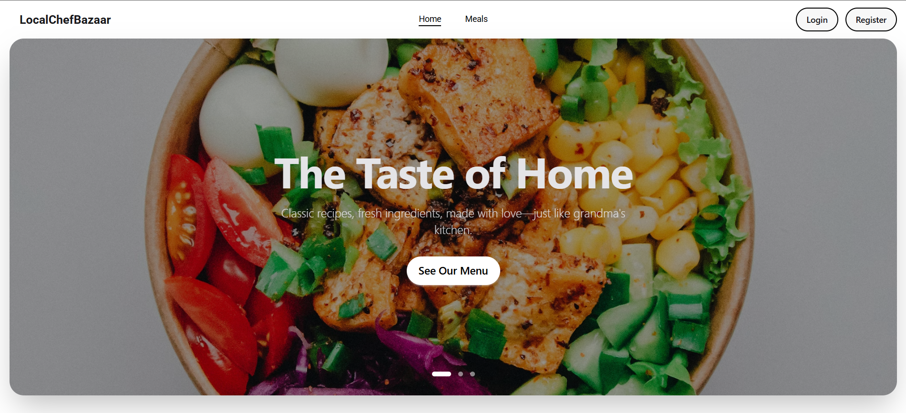

# Chef - Restaurant Management Platform

A modern, full-stack restaurant management platform built with the MERN stack, featuring role-based access control, real-time order tracking, and integrated payment processing.

## 🌐 Live Demo

**Frontend:** [https://restaurant-c51e9.web.app](https://restaurant-c51e9.web.app)

**Backend:** [https://chef-backend-seven.vercel.app](https://chef-backend-seven.vercel.app)

## 📸 Screenshots

### Homepage Hero Section


*The Taste of Home - Classic recipes, fresh ingredients, made with love—just like grandma's kitchen.*

## ✨ Features

### User Features
- 🔐 Secure authentication with Firebase
- 🍽️ Browse and search meals with advanced filtering
- ⭐ Add meals to favorites
- 💳 Secure payment processing with Stripe
- 📦 Track orders in real-time
- ✍️ Write and manage reviews
- 👤 Profile management

### Chef Features
- 🍳 Create and manage meals
- 📋 View and approve order requests
- 📊 Track meal performance
- ✏️ Update meal details and pricing

### Admin Features
- 👥 Manage users and roles
- 📑 Handle chef/admin role requests
- 📈 View platform statistics and analytics
- 🚫 Mark fraudulent users
- 📊 Interactive charts for data visualization

## 🛠️ Technologies Used

### Frontend
- **Framework:** React 18 with Vite
- **Routing:** React Router v7
- **Styling:** TailwindCSS + DaisyUI
- **State Management:** TanStack Query (React Query)
- **Animations:** Framer Motion
- **Charts:** Recharts
- **HTTP Client:** Axios
- **Authentication:** Firebase Authentication
- **Payments:** Stripe Checkout
- **Alerts:** SweetAlert2
- **Form Handling:** React Hook Form

### Backend
- **Runtime:** Node.js with Express
- **Database:** MongoDB Atlas
- **Authentication:** Firebase Admin SDK (JWT)
- **Payments:** Stripe API
- **Security:** CORS with credentials

## 📋 Prerequisites

- Node.js (v18 or higher)
- npm or yarn
- Firebase account
- Stripe account (for payments)
- MongoDB Atlas account

## 🚀 Installation

1. **Clone the repository**
   ```bash
   git clone <repository-url>
   cd Chef/frontend
   ```

2. **Install dependencies**
   ```bash
   npm install
   ```

3. **Create environment variables**
   
   Create a `.env` file in the root directory with the following variables:
   ```env
   # Firebase Configuration
   VITE_APIKEY=your_firebase_api_key
   VITE_AUTHDOMAIN=your_firebase_auth_domain
   VITE_PROJECTID=your_firebase_project_id
   VITE_STORAGEBUCKET=your_firebase_storage_bucket
   VITE_MESSAGINGSENDERID=your_firebase_messaging_sender_id
   VITE_APPID=your_firebase_app_id
   ```

4. **Start the development server**
   ```bash
   npm run dev
   ```

5. **Open your browser**
   
   Navigate to `http://localhost:5173`

## 📜 Available Scripts

- `npm run dev` - Start development server
- `npm run build` - Build for production
- `npm run preview` - Preview production build locally
- `npm run lint` - Run ESLint

## 🏗️ Project Structure

```
frontend/
├── public/              # Static assets
├── src/
│   ├── assets/         # Images, icons, etc.
│   ├── auth/           # Firebase authentication config
│   ├── Components/     # Reusable UI components
│   ├── Context/        # React Context providers
│   ├── Hooks/          # Custom React hooks
│   ├── Pages/          # Page components
│   ├── Provider/       # Auth and other providers
│   ├── Roots/          # Layout components
│   ├── router/         # Route configurations
│   ├── Routes/         # Protected route components
│   ├── App.jsx         # Main App component
│   └── main.jsx        # Application entry point
├── .env                # Environment variables
├── firebase.json       # Firebase hosting config
├── index.html          # HTML template
├── package.json        # Dependencies
├── tailwind.config.js  # TailwindCSS configuration
└── vite.config.js      # Vite configuration
```

## 🔑 Key Features Implementation

### Authentication
- JWT-based authentication with Firebase
- HTTP-only cookies for secure token storage
- Protected routes based on user roles
- Automatic token refresh

### Payment Integration
- Stripe Checkout Sessions
- Payment status tracking
- Automatic order status updates

### Responsive Design
- Mobile-first approach
- Hamburger menu for mobile navigation
- Responsive tables and cards
- Touch-friendly UI elements

### Performance Optimization
- Code splitting with lazy loading
- Image optimization
- Efficient state management with React Query
- Debounced search functionality

## 🌐 Deployment

### Firebase Hosting

1. **Install Firebase CLI**
   ```bash
   npm install -g firebase-tools
   ```

2. **Login to Firebase**
   ```bash
   firebase login
   ```

3. **Build the project**
   ```bash
   npm run build
   ```

4. **Deploy to Firebase**
   ```bash
   firebase deploy
   ```

## 🔐 Environment Variables

| Variable | Description |
|----------|-------------|
| `VITE_APIKEY` | Firebase API Key |
| `VITE_AUTHDOMAIN` | Firebase Auth Domain |
| `VITE_PROJECTID` | Firebase Project ID |
| `VITE_STORAGEBUCKET` | Firebase Storage Bucket |
| `VITE_MESSAGINGSENDERID` | Firebase Messaging Sender ID |
| `VITE_APPID` | Firebase App ID |

## 🤝 Contributing

Contributions are welcome! Please feel free to submit a Pull Request.

## 📝 License

This project is licensed under the MIT License.

## 👨‍💻 Author

**Ahmed Abrar Zayad**

## 🙏 Acknowledgments

- Firebase for authentication services
- Stripe for payment processing
- Vercel for backend hosting
- Firebase for frontend hosting
- TailwindCSS for the utility-first CSS framework
